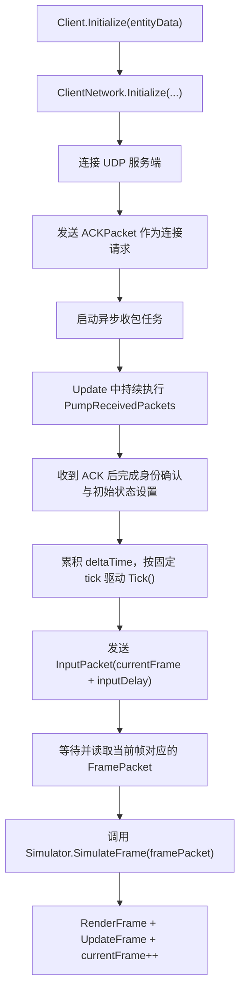
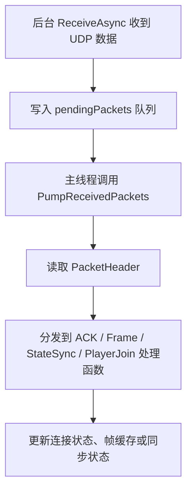
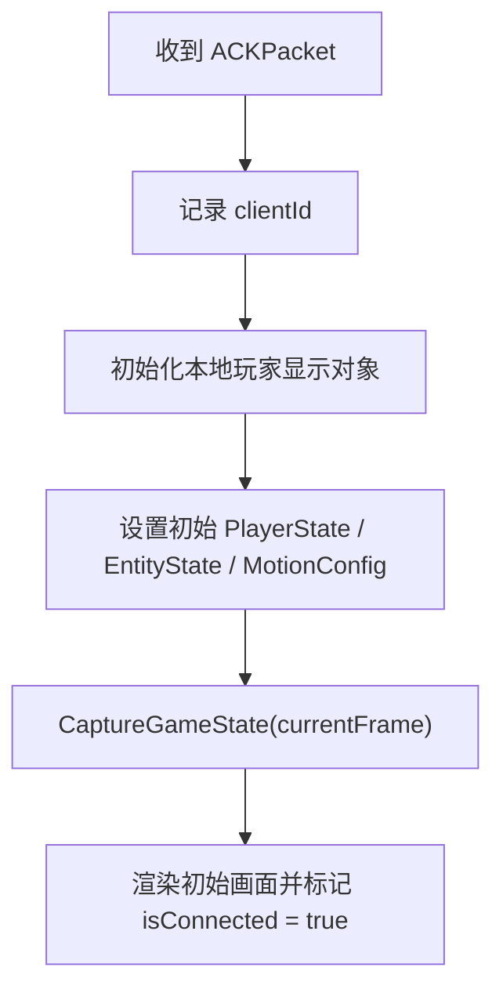
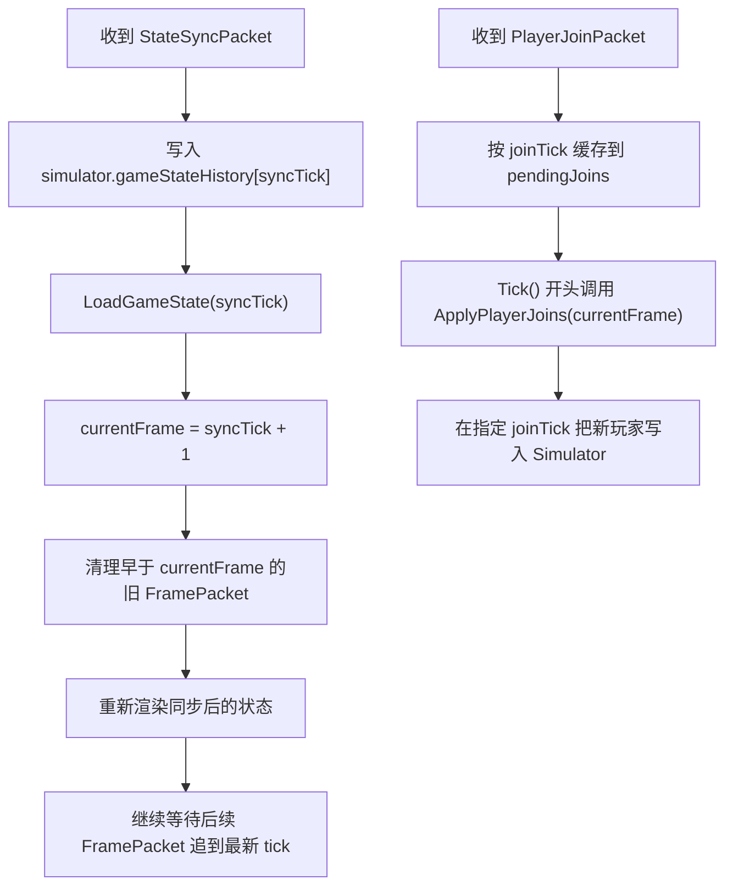

# 客户端运行流程

这份文档概括 Unity 客户端从启动连接、接收服务端数据，到按固定 tick 推进模拟和处理状态同步的主要流程。

## 客户端主流程

## 收包分发流程

## 首次连接完成时

## 状态同步与运行中加入

## 关键点

- 客户端发给服务端的是输入，而不是最终坐标；真正的位置结果由 `Simulator` 计算得出。
- 客户端只会在拿到对应 tick 的 `FramePacket` 后推进正式模拟，因此服务端广播顺序直接决定追帧节奏。
- `InputDelay` 让输入先发往未来帧，减少网络往返对当前帧推进的阻塞。
- `StateSyncPacket` 与历史 `FramePacket` 组合起来，构成断线重连和运行中加入后的追帧基础。
