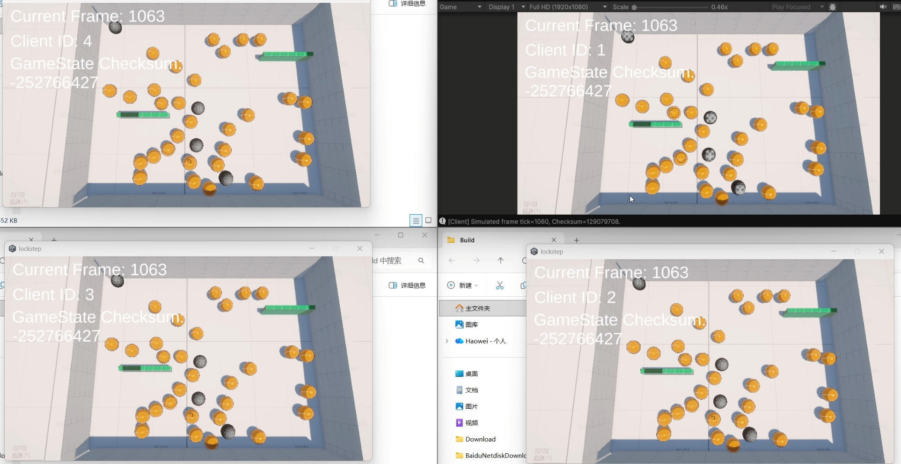

# Unity Lockstep

一个用来学习和验证帧同步思路的 Unity Demo。项目的目标不是直接做成完整游戏，以学习为用途：

- 固定 tick 推进
- 确定性模拟
- 帧同步为主，断线重连使用状态同步
- 客户端与服务端共用同一套模拟逻辑

当前 Demo 主要关注二维平面上的移动与碰撞，不处理完整 3D 垂直运动。

## 流程图导航

- [服务端连接流程](./ServerHost/ConnectionFlow.md)
- [客户端运行流程](./ClientFlow.md)

## 效果截图

## 这个项目已经做到什么

- 客户端只发送输入，不直接发送位置状态。
- 服务端按 tick 收集所有客户端输入并广播 `FramePacket`。
- 客户端和服务端都运行同一套 `Simulator`，推进相同的 `GameState`。
- 模拟层统一使用 `Vector3i` 定点整数，避免浮点误差带来的分歧。
- 已支持玩家移动、实体运动、球体碰撞、盒体与球体碰撞、玩家与实体碰撞、实体间碰撞。
- 已保存历史 `GameState`，并提供历史状态恢复入口。
- 已提供状态 checksum，方便继续做客户端/服务端分歧检测。
- 服务端保留历史帧包，并已具备给重连客户端下发历史状态与补帧的基础能力。
- 已支持运行中的新玩家加入和旧玩家重连的基本流程骨架。

## 核心模块

### Client

[`Assets/Scripts/Client/Client.cs`](./Assets/Scripts/Client/Client.cs) 是 Unity 客户端主入口，负责：

- 初始化网络连接和本地渲染组件
- 采集本地输入并发送 `InputPacket`
- 缓存服务端下发的 `FramePacket`
- 以固定 tick 驱动模拟
- 将指定 tick 的 `GameState` 渲染到场景中
- 在收到状态同步包后恢复到历史 tick 并继续追帧

### Simulator

[`Assets/Scripts/Shared/Simulator.cs`](./Assets/Scripts/Shared/Simulator.cs) 是整个项目的核心。客户端和服务端都依赖它做确定性模拟，它负责：

- 根据输入推进玩家状态
- 更新实体位置与速度
- 处理碰撞
- 保存每一帧的 `GameState`
- 从历史帧恢复状态
- 计算指定 tick 的 checksum

如果后面要继续做 rollback、重放、断线恢复，这里会是最重要的基础层。

### Shared Packets / Codec

[`Assets/Scripts/Shared/Packets.cs`](./Assets/Scripts/Shared/Packets.cs) 和 [`Assets/Scripts/Shared/Codec.cs`](./Assets/Scripts/Shared/Codec.cs) 定义并编码网络消息，当前涉及：

- `ACKPacket`：连接握手与客户端身份分配
- `InputPacket`：客户端上传输入
- `FramePacket`：服务端广播某一 tick 的完整输入集合
- `StateSyncPacket`：状态同步
- `PlayerJoinPacket`：运行中新玩家加入的同步通知
- `ResendFramePacket`：为可靠性补强预留的数据结构基础

### ServerHost

[`ServerHost/Program.cs`](./ServerHost/Program.cs) 是一个轻量 UDP 服务端，当前负责：

- 监听客户端连接请求
- 分配 `clientId`
- 管理初次连接、运行中加入、断线重连
- 按 tick 缓存输入
- 生成并广播 `FramePacket`
- 同步推进服务端权威模拟
- 为状态同步与补发历史帧提供基础支持

[`ServerHost/ConnectionFlow.md`](./ServerHost/ConnectionFlow.md) 用 Mermaid 流程图整理了首连、运行中加入、断线重连和状态同步的主流程，更适合快速阅读和展示。[`ClientFlow.md`](./ClientFlow.md) 则补充了客户端从连接、收包、推进模拟到状态同步追帧的完整路径。

这套设计的关键点是：网络里传的是“输入”，不是“最终位置”；真正的状态由同一套确定性模拟算出来。

## 状态同步与重连基础

这个项目最有价值的一点，不只是“能跑”，而是已经把后续做完整同步系统需要的几个拼图先搭好了：

- 服务端保存历史 `GameState`
- 服务端保存最近一段 `FramePacket`
- 客户端支持加载 `StateSyncPacket`
- 客户端加载历史状态后会清理旧帧并从同步 tick 之后继续追帧
- 服务端已经区分“初次连接”“运行中加入”“断线重连”三类场景

也就是说，后续如果要继续把断线恢复做完整，主要工作已经从“推翻重做”变成“把现有能力串起来”。

## 目前已知问题

- 客户端出现 tick 差异时还没有倍速追帧。最直接的表现是 Unity Editor 暂停后，一般会和服务端出现 2-3 tick 的时间差。
- 当前是纯 socket 通信，还没有接入更完整的网络库、可靠 UDP 层或传输框架。
- 断线逻辑没有完整实现，目前只实现了重连同步和相关逻辑的切口。
- 由于会保存历史 `GameState`，当场景里存在大规模物体时，内存占用会非常高。
- 没有为大规模物体做渲染优化，实体数量变大后客户端渲染压力会快速上升。
