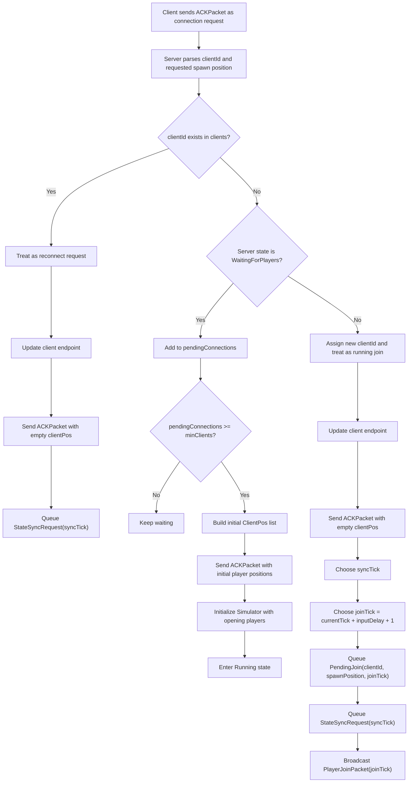
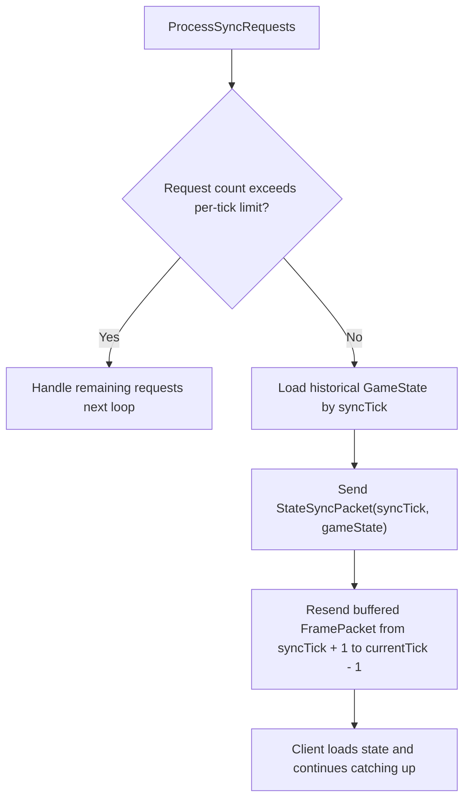
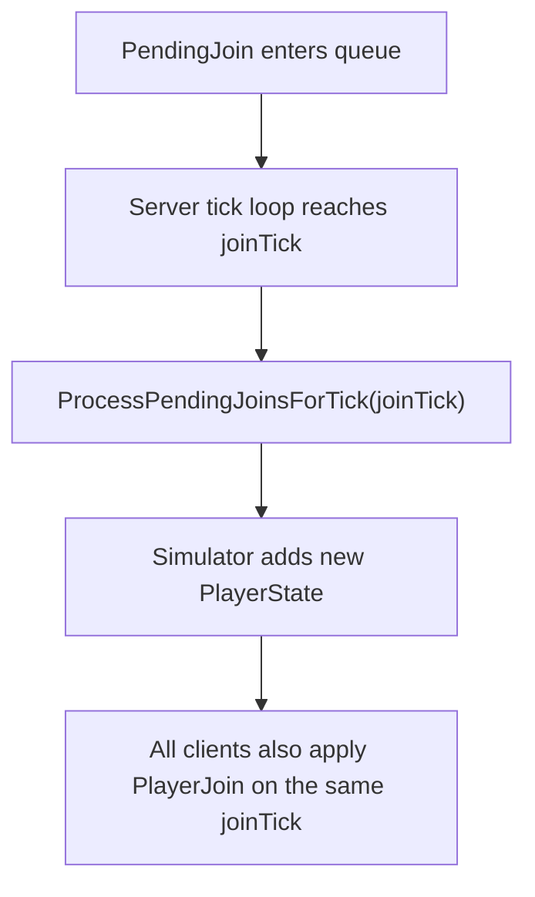

# Connection Flow

这份文档用流程图概括 `ServerHost` 当前的连接处理主流程，方便快速理解服务端如何区分首连、运行中加入和断线重连。

## Server Connection Flow

## State Sync And Catch-Up

## Join Application Timing

## Key Points

- 首次开局时，`pendingConnections` 只用于凑齐开局玩家并生成初始玩家列表。
- 运行中的新玩家加入不会直接插入当前帧，而是延后到未来的 `joinTick` 同步生效。
- 断线重连和运行中加入都会先收到 `ACKPacket`，再通过 `StateSyncPacket` 恢复到历史状态。
- 状态同步之后，客户端依靠补发的历史 `FramePacket` 追到服务端当前 tick。
