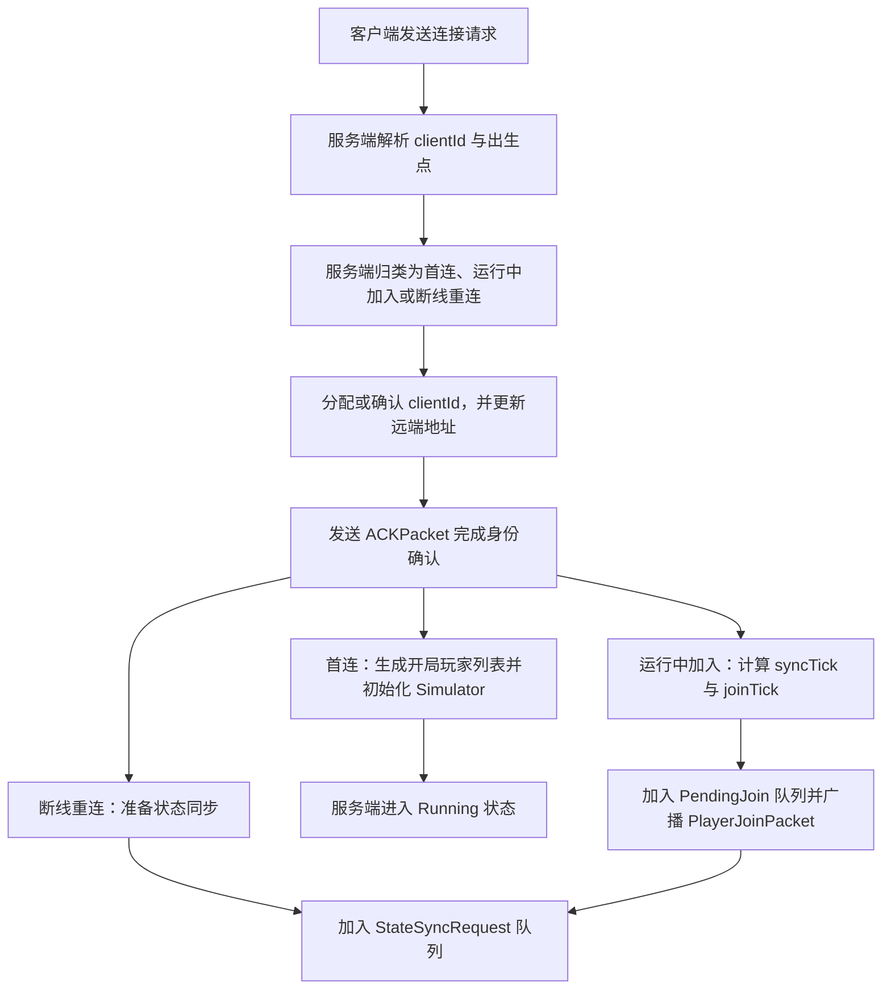
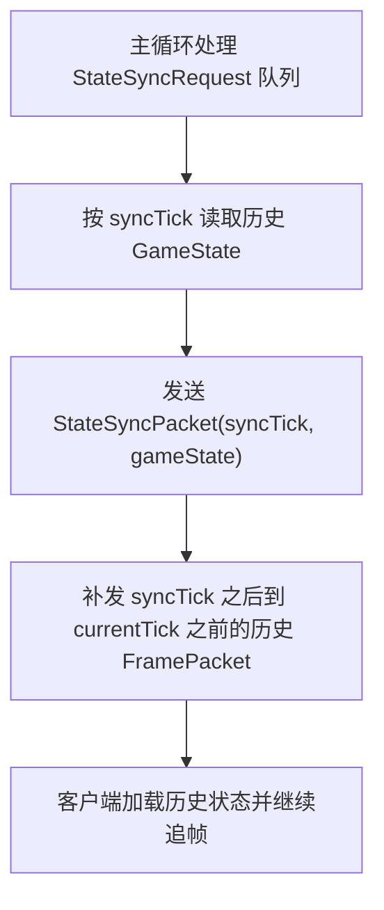
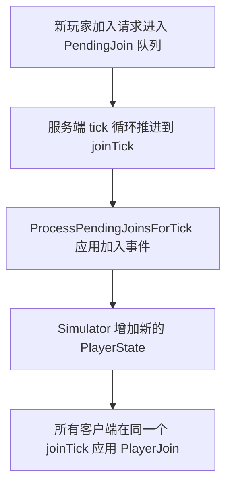

# 服务端连接流程

这份文档用流程图概括 `ServerHost` 当前的连接处理方式，重点说明服务端如何区分首连、运行中加入、断线重连，以及状态同步如何接回主循环。

## 总览

## 状态同步与补帧

## 运行中加入何时真正生效

## 关键点

- `pendingConnections` 只用于开局阶段聚合首批玩家，不参与运行期的正式玩家状态维护。
- 运行中的新玩家不会立刻插入当前帧，而是延后到未来的 `joinTick` 统一生效。
- 断线重连与运行中加入都会先拿到 `ACKPacket`，再通过 `StateSyncPacket` 恢复到历史状态。
- 状态同步完成后，客户端还需要依赖补发的历史 `FramePacket` 追到服务端当前 tick。
